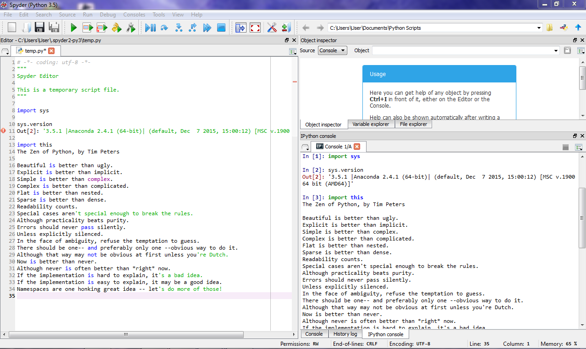

UECM3033 Assignment #1 Report
========================================================

- Prepared by: Liew Kok Hoong
- Tutorial Group: T3

--------------------------------------------------------

## Task 1 -- setup a github repository

The reports, codes and supporting documents are uploaded to Github at: 

[https://github.com/1203222/UECM3033_assign1](https://github.com/1203222/UECM3033_assign1)

---------------------------------------------------------

## Task 2 -- setup python

The screen shot of file (python.png)

------------------------------------------------------------

## Task 3 -- modify and run Python script

1. The hexadecimal value of 1203222 is 0x125c16.
2. The definite integrals that I have chosen is 
   
   $$\int_4^{\infty} e^{-x/2} dx = {2} e^{-2}.$$

3. My system of 10 linear equations are

   \begin{align*}
   7 x_0 + 64 x_1 + 36 x_2 + 44 x_3 + 72 x_4 + 82 x_5 + 96 x_6 + 46 x_7 + 100 x_8 + 35 x_9 &= 96,\\\
   44 x_0 + 47 x_1 + 34 x_2 + 84 x_3 + 94 x_4 + 36 x_5 + 84 x_6 + 68 x_7 + 7 x_8 + 10 x_9 &= 76,\\
   98 x_0 + 46 x_1 + 53 x_2 + 48 x_3 + 66 x_4 + 8 x_5 + 60 x_6 + 53 x_7 + 82 x_8 + 98 x_9 &= 26,\\
   26 x_0 + 80 x_1 + 12 x_2 + 21 x_3 + 88 x_4 + 48 x_5 + 47 x_6 + 46 x_7 + 82 x_8 + 84 x_9 &= 58,\\
   20 x_0 + 50 x_1 + 24 x_2 + 54 x_3 + 39 x_4 + 75 x_5 + 2 x_6 + 34 x_7 + 54 x_8 + 70 x_9 &= 92,\\
   6 x_0 + 40 x_1 + 12 x_2 + 92 x_3 + 13 x_4 + 25 x_5 + 48 x_6 + 28 x_7 + 22 x_8 + 66 x_9 &= 46,\\
   20 x_0 + 76 x_1 + 74 x_2 + 39 x_3 + 42 x_4 + 96 x_5 + 71 x_6 + 22 x_7 + 60 x_8 + 44 x_9 &= 12,\\
   36 x_0 + 66 x_1 + 13 x_2 + 44 x_3 + 18 x_4 + 70 x_5 + 88 x_6 + 29 x_7 + 8 x_8 + 22 x_9 &= 88,\\
   56 x_0 + 77 x_1 + 96 x_2 + 92 x_3 + 80 x_4 + 66 x_5 + 60 x_6 + 42 x_7 + 83 x_8 + 12 x_9 &= 92,\\
   29 x_0 + 14 x_1 + 40 x_2 + 78 x_3 + 30 x_4 + 64 x_5 + 56 x_6 + 78 x_7 + 22 x_8 + 21 x_9 &= 58.
   \end{align*}
   
   \begin{align*}
   Solution  = [ x_0 = 1.22519689, x_1 = -0.14478094, x_2 = -2.02924909, x_3 = 1.18440703, x_4 = 0.33441216, x_5 = 1.13264331, x_6 =     -0.27977311, x_7 = -0.7005246, x_8 = 0.91539039, x_9 = -0.90807019 ] 
   \end{align*}

-----------------------------------

last modified: 28 January 2016
